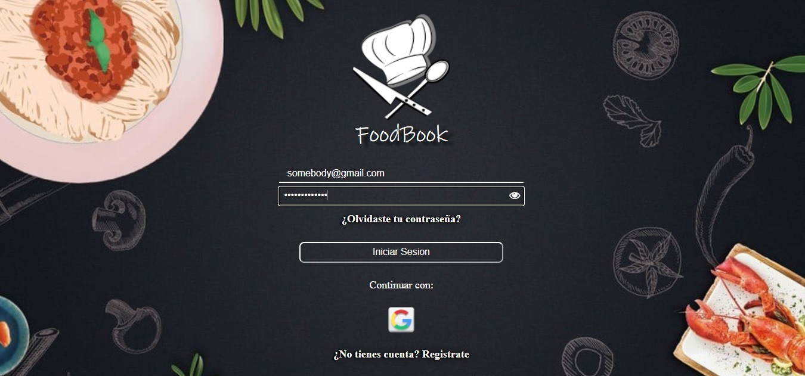
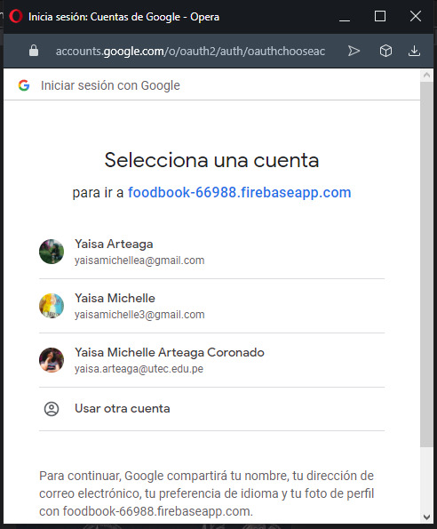
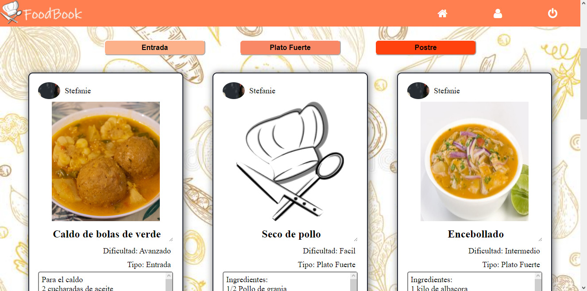
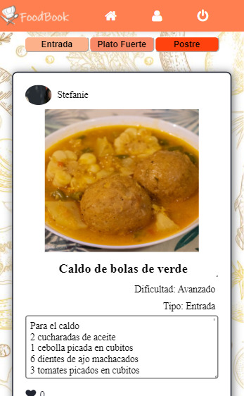
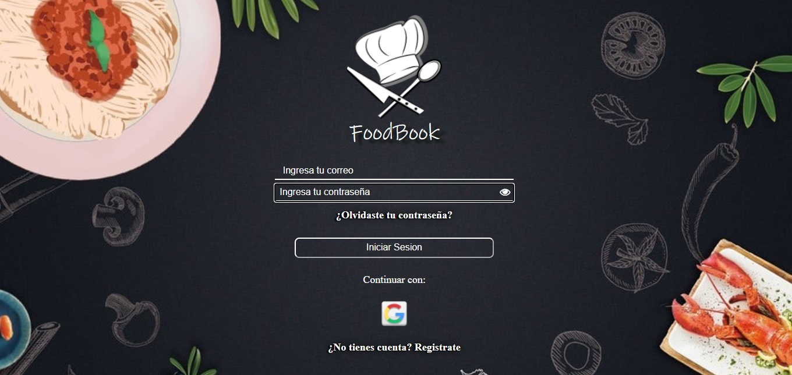

# Creando una Red Social

## Preámbulo

En la actualidad, las redes sociales se han convertido en un recurso indispensable para nuestras labores cotidianas, y no abarcan unicamente el ambito social, sino tambien el ambito profesional. Su utilidad no esta limitada unicamente al ocio y distraccion sino tambien que resulta una herramienta muy util para encontrar informacion necesaria para resolver problemas que se puedan presentar.

_Imagen tomada de [EscuelaErgon](https://escuelaergon.com/las-10-redes-sociales-mas-usadas-del-mundo/)_.

De manera general, las redes sociales estan totalmente inmersas en nuestro entorno social, y han influido significativamente tanto en la forma de relacionarnos, como de conocer personas, así como en la forma en que otras personas pueden conocernos a nosotros; es asi como podemos encontrar un sinnumero de tematicas abordadas por las redes sociales, desde una red social donde puedes compartir tus viajes y actividades recreativas, asi como aquellas que estan dirigidas a compartir informacion de perfiles profesionales.

***

### Definición del producto

FoodBook fue pensado y diseñado para los amantes de la gastronomía quienes gustan de compartir y conocer nuevas recetas de todo tipo de comida de diferentes partes del mundo, donde se le permite al usuario compartir sus recetas de manera detallada, asi como fotos para hacer lucir sus deliciosos platillos. Asimismo, FoodBook esta dirigida para todo tipo de personas, indistintamente de la edad, el unico requisito es ser amante de la cocina y tener la disposición de compartir sus mejores recetas con los demás. 

***

### Historias de usuario

| ***HISTORIA DE USUARIO 1:*** Como usuario de FoodBook quiero poder ingresar mi usuario y contrasena para iniciar sesion|
|---------------------------|
||
|***Criterios de aceptacion***|
|Deben existir los inputs para ingresar el usuario y contrasena|
|Al presionar el icono del input contrasena el texto se muestre y se oculte|
|Debe existir un boton para iniciar sesion|
|***Definicion de terminado***|
|Al ingresar un usuario y contrasena validos se puede iniciar sesion|
|Cumple los tests unitarios|
|El diseño es reponsive|
|Es una SPA|

|***HISTORIA DE USUARIO 2:*** Como usuario de FoodBook quiero poder iniciar sesion con mi cuenta de google|
|---------------------------|
||
|***Criterios de aceptacion***|
|Deben existir los iconos para ingresar por medio google|
|***Definicion de terminado***|
|Al dar click en uno de los iconos permite iniciar sesion|
|Cumple los tests unitarios|
|El diseño es reponsive|
|Es una SPA|

|***HISTORIA DE USUARIO 3:*** Como nuevo usuario de FoodBook quiero poder crear una cuenta para iniciar sesion|
|---------------------------|
||
|***Criterios de aceptacion***|
|Deben existir los inputs para ingresar el usuario, contrasena y confirmar contrasena|
|Al presionar el icono del input contrasena el texto se muestre y se oculte|
|Debe existir un boton para registrarse|
|***Definicion de terminado***|
|Al ingresar un usuario y contrasena validos se envia un correo de confirmacion al usuario|
|Cumple los tests unitarios|
|El diseño es reponsive|
|Es una SPA|

|***HISTORIA DE USUARIO 4:*** Como usuario de FoodBook quiero poder crear una publicacion|
|---------------------------|
||
|***Criterios de aceptacion***|
|Deben existir los inputs para ingresar el titulo y la descripción|
|Al presionar el icono de la imagen se puede seleccionar una foto para el post|
|Debe existir un boton para publicar el post|
|***Definicion de terminado***|
|El usuario puede cargar una foto en su post|
|Se muestran mensajes de error si el usuario intenta publicar teniendo campos vacios|
|Cumple los tests unitarios|
|El diseño es reponsive|
|Es una SPA|

|***HISTORIA DE USUARIO 5:*** Como usuario de FoodBook quiero poder ver las publicaciones/recetas por tipo de plato|
|---------------------------|
||
|***Criterios de aceptacion***|
|Deben existir los botones por categoria|
|Deben de podr visualizarse los posts|
|***Definicion de terminado***|
|El usuario puede ver los post de todos los usarios de la app|
|Cumple los tests unitarios|
|El diseño es reponsive|
|Es una SPA|

***

### Diseño de la Interfaz de Usuario 
Se diseñó un prototipo en figma de las versiones tanto para desktop como mobile, se siguió la tecnica de _`mobile first`_ como se muestra a continuacion:
* Vista mobile

    

* Vista Desktop

    

